# Stealth Runner

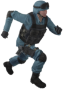 Stealth Runner is a third-person
open-world action game for the TI-99/4A home computer.

## Features

* Pre-rendered graphics.
* Smooth motion-captured animation (30 fps).
* Pixel-precise omni-directional scrolling.
* Sound and speech.
* Entirely written in TMS-9900 assembly code.
* The source code!

## Screenshots

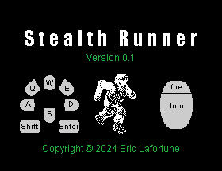
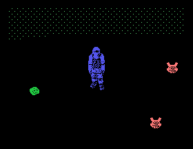
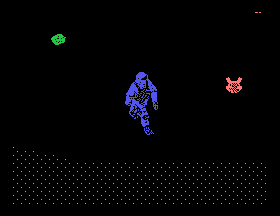
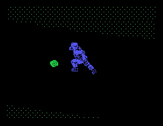
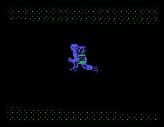
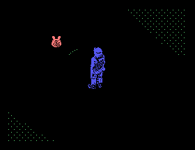
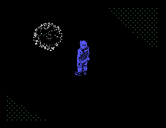
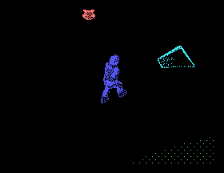
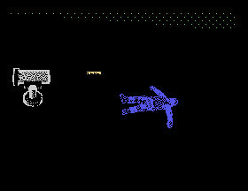
   
You can also see a [video](https://youtu.be/e1ln8T1XRmM) on Youtube.

## Requirements

* TI-99/4A home computer.
* Programmable ROM/RAM cartridge, with about 1.5 MB of space.
* 32K memory expansion.
* Mechatronic mouse (recommended).
* Speech synthesizer (optional).

or:

* An emulator for the TI-99/4A, such as Mame.

## Downloading

You can download the [latest
binary](https://github.com/EricLafortune/StealthRunner/releases/latest) from
Github.

## Building

If you want to build the game yourself, you'll need a couple of tools. These
are readily available for Linux distributions, but other platforms may work
as well.

* The 3D animation package [Blender](https://www.blender.org/) (Debian package
  `blender`), for rendering the player avatar and the objects in the game world.
* The image toolkit [ImageMagick](https://imagemagick.org/) (Debian package
  `imagemagick`), for processing animation frames.
* The video converter `ffmpeg` (Debian package `ffmpeg`), for processing sound
  files.
* The tool `xxd` (Debian package `xxd`), for converting simple hex source files
  to binary files.
* My [Video Tools](https://github.com/EricLafortune/VideoTools/) for the
  TI-99/4A, for computing speech coefficients and for creating the intro video.
* A Java development environment (Debian package `openjdk-17-jdk`, for example),
  version 14 or higher, for the video tools.
* The [xdt99](https://github.com/endlos99/xdt99) cross-development tools, for
  assembling the final video player.
* A Python 3 runtime environment (Debian package `python3`) for the
  cross-development tools.

On Linux, you can then run the build script:

    ./build.sh

Alternatively, you can run its commands manually.

You'll then have
* a raw cartridge ROM file `out/romc.bin`.
* a cartridge file `out/StealthRunner.rpk` that is suitable for emulators like
  Mame.

## Running

The easiest way is to use the Mame emulator (version 0.243 or higher).

On Linux, you can run the script to launch Mame with the proper options:

    ./run.sh

Alternatively, you can run the Mame command manually. The game targets an
NTSC system, with a display at 60 Hz.

With the computer or emulator running, at the TI-99/4A home screen:

1. Press any key.
2. Press <kbd>2</kbd> for "STEALTH RUNNER".

The game then starts. The goal of the game is to find and reach the target
cross in the world, evading or destroying enemy devices. You may encounter:

|                                |                                             |
|--------------------------------|---------------------------------------------|
|    | The target to reach.                        |
|  | Battery charge for Electro-Magnetic Pulses. |
|        | Enemy mine.                                 |
|      | Enemy drone.                                |
| 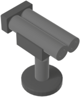   | Enemy gun turret.                           |

You can control your avatar with the keyboard and optionally a Mechatronic
mouse (recommended):

|                                  |                                      |
|----------------------------------|--------------------------------------|
| <kbd>Q</kbd>                     | Turn left.                           |
| <kbd>E</kbd>                     | Turn right.                          |
| <kbd>W</kbd>                     | Move forward.                        |
| <kbd>S</kbd>                     | Move backward.                       |
| <kbd>A</kbd>                     | Strafe left forward.                 |
| <kbd>D</kbd>                     | Strafe right forward.                |
| <kbd>Shift</kbd>                 | Speed up from walking to running.    |
| <kbd>Enter</kbd>                 | Fire an Electro-Magnetic Pulse.      |
| Mouse                            | Turn.                                |
| Mouse button                     | Fire an Electro-Magnetic Pulse.      |
| <kbd>6</kbd> = <kbd>Proc'd</kbd> | Pause/unpause the game.              |
| <kbd>8</kbd> = <kbd>Redo</kbd>   | Restart the game.                    |
| <kbd>9</kbd> = <kbd>Back</kbd>   | Return to the game title screen.     |
| <kbd>=</kbd> = <kbd>Quit</kbd>   | Return to the computer title screen. |
    
When you die or reach the target cross, you can quit the level with
<kbd>Redo</kbd>, <kbd>Back</kbd>, or <kbd>Quit</kbd>.

You can exit Mame by pressing <kbd>Esc</kbd>.

## Technical background

The game tries to push the envelope of what is achievable on the TI-99/4A.
Can we deliver interactive, motion-captured, pre-rendered graphics, with the
help of freely available modern-day resources?

The implementation builds on my experiences with streaming graphics, sound,
and speech in my [Bad Apple](https://github.com/EricLafortune/BadApple) demo
for the TI-99/4a. The demo is linear; this game is fully interactive. The
general strategy is still to preprocess resources to efficient custom formats.

The player's avatar and its motion-captured animations originate from
[Mixamo](https://mixamo.com/). They have an amazing collection of 3D character
models and motion-captured animations, which can be downloaded for free.

I've imported the "SWAT" character and animations in the open-source animation
package [Blender](https://www.blender.org/). I've additionally created static
3D objects. The build process runs custom python scripts in Blender to render
the character and the objects. Each motion-captured animation has between 20
and 31 frames and is rendered from 16 viewing angles.

Further python/bash/java scripts/programs massage the resulting images. I'm
using the open-source toolkit [ImageMagick](https://imagemagick.org/) to
reduce the resolution and the number of colors, since the TI-99/4A supports a
fixed resolution of 256x192 pixels and a fixed palette of 16 colors. The
scripts eventually convert the images to efficient, custom file formats for
the game.

I've manually created some sound effects for the sound processor of the TI.
I've also downloaded some public-domain sound files, which my open-source
[Video Tools](https://github.com/EricLafortune/VideoTools/) can convert to
speech coefficients for the speech synthesizer of the TI.

The game world is represented by a plain image file, which gets converted to
custom formats as well.

I've created the short introductory animation sequence with Blender,
ImageMagick, and my Video Tools.

The assembly code ties together all resulting assets. For low-level code, it
is still quite readable, thanks to macros and comments, and thanks to the
excellent [xdt99](https://github.com/endlos99/xdt99) cross-development tools.
The major challenge is to efficiently stream graphics to the video display
processor. The code tries to update just the changes between frames: characters
and patterns of the landscape, characters and patterns of the player's avatar,
positions and patterns of the sprites. Standard 16x16 pixel sprites are
combined into larger sprites. They are cached in the available space in video
memory and swapped in when necessary. The most performance-sensitive code is
run from the computer's 256 bytes of 16-bit scratchpad RAM. The game
interleaves all computations between even and odd frames at 60 NTSC video
frames per second, resulting in updates at 30 frames per second.
        
The source code contains a collection of [include files](../src/include) that
can be generally useful for game development. They provide convenient and
efficient support for graphics, sound, speech, and keyboard/mouse input.

## License

Stealth Runner is released under the GNU General Public License, version 2.

Enjoy!

Eric Lafortune
